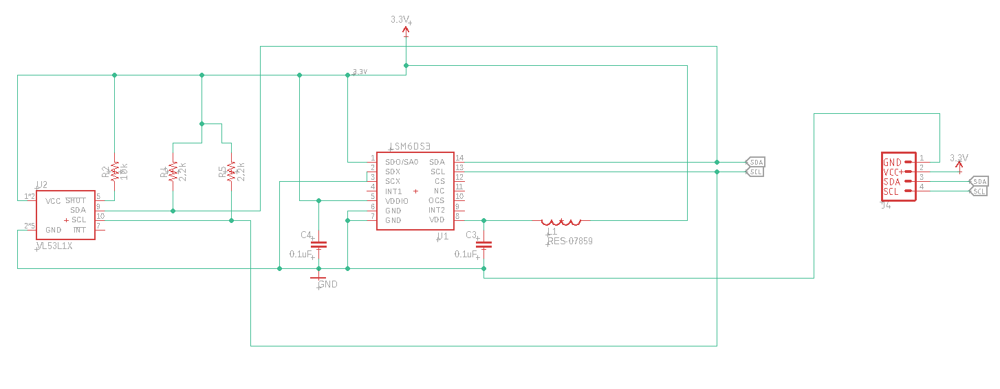
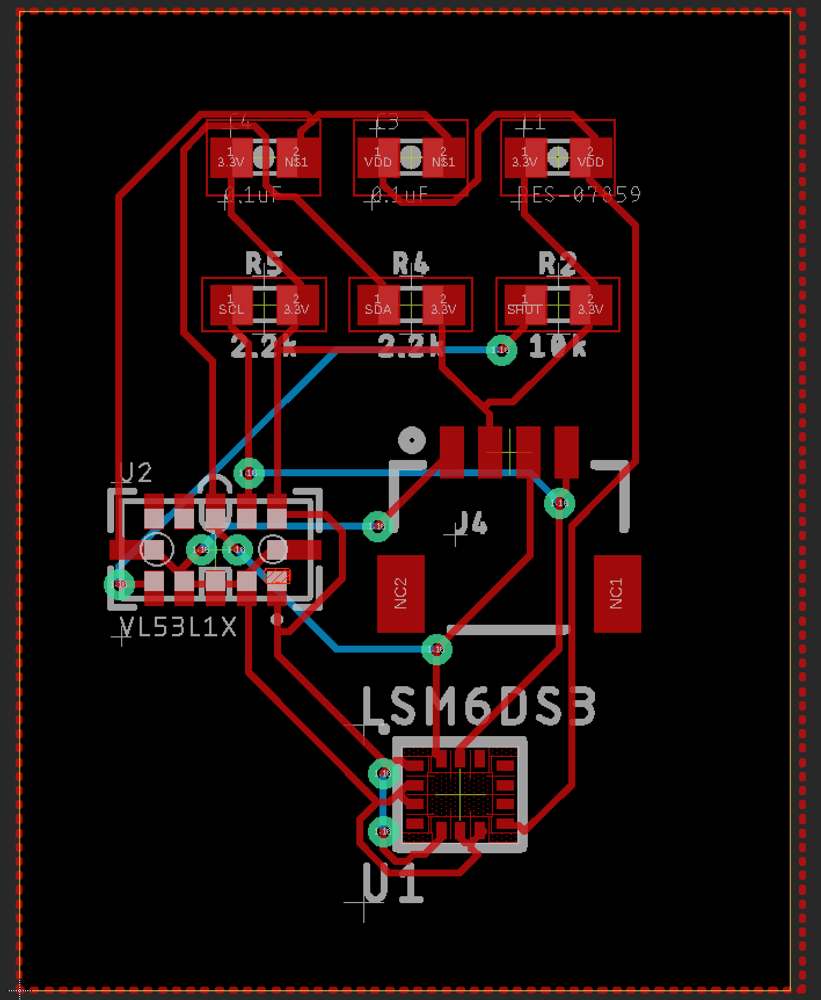

# Robo-Skin Circuit Schematics

Below is the schematic file:

Below is the Board file:

The gerber files will be in the CamOutput folder. The .sch file is the eagle schematics and .brd is the board file. 

Modifications and suggestions are highly appreciated. Be sure to give a PR.