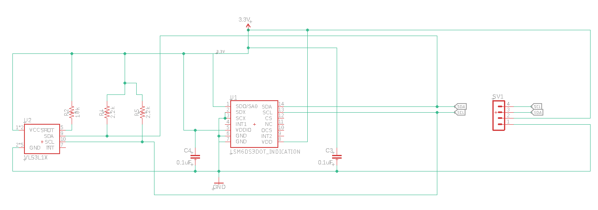
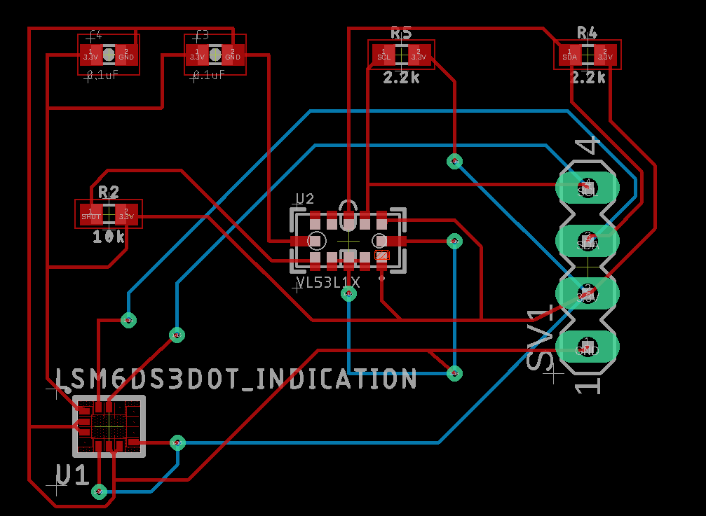

# Robo-Skin Circuit Schematics

Below is the schematic file:



Below is the Board file:



The gerber files will be in the CamOutput folder. The .sch file is the eagle schematics and .brd is the board file. 

The schematics contain circuit in human readable format

The board files contain circuit which can be etched on a copper sheet, basically the final how circuit board looks like

You can install final gerber files like this:

```bash
sudo apt install gerbv
gerbv GERBER_FILE_PATH
```

Modifications and suggestions are highly appreciated. Be sure to give a PR.
